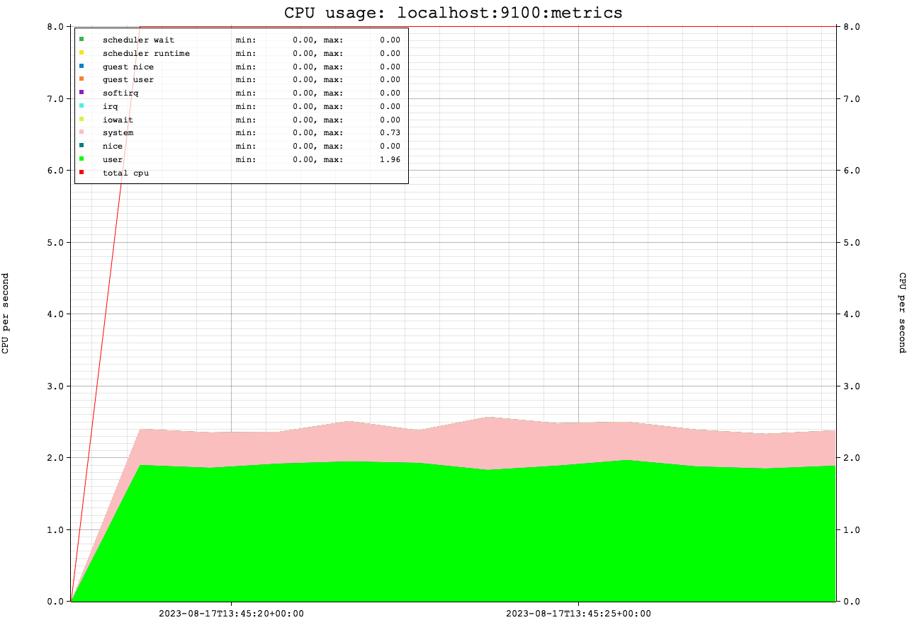

README for dsar

dsar is a commandline utility that collects statistics from prometheus (node_exporter) endpoints. 

The prometheus data from multiple machines and multiple endpoints is read, 
after which it will pick all statistics that are currently set to be stored, and stores these for each interval.

Therefore the minimal requirement to run dsar is to specify one or more hostnames or ip addresses.

The output by default is identical to the sar utility (sar on recent linux versions):

```shell
hostname                       time     CPU      %usr     %nice      %sys   %iowait    %steal     %idle
localhost:9100:metrics         13:41:04 all       NaN       NaN       NaN       NaN       NaN       NaN
localhost:9100:metrics         13:41:05 all     25.66      0.00      8.05      0.00      0.00     66.29
localhost:9100:metrics         13:41:06 all     24.56      0.00      8.40      0.00      0.00     67.04
localhost:9100:metrics         13:41:07 all     25.13      0.00      7.29      0.00      0.00     67.59
```

If the `-g` or `--graph` switch is added, dsar will create graphical plots of the performance metrics:



