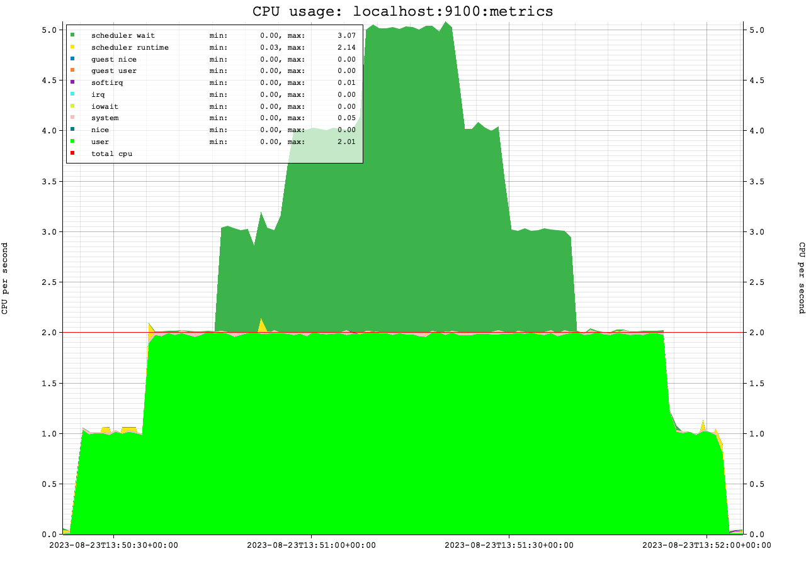

# README for dsar

dsar is a commandline utility that collects statistics from prometheus format endpoints. 
Currently it will store statistics from node_exporter and from the YugabyteDB server processes (tablet servers and masters) in memory for the sake of being able to potentially graph them over time (see below graph). 

The prometheus data from multiple machines and multiple endpoints is read, 
after which it will pick all statistics that are currently set to be stored, and stores these for each interval.

Therefore the minimal requirement to run dsar is to specify one or more hostnames or ip addresses.

The output by default is identical to the sar utility (sar on recent linux versions):

```shell
hostname                       time     CPU      %usr     %nice      %sys   %iowait    %steal     %idle
localhost:9100:metrics         13:41:04 all       NaN       NaN       NaN       NaN       NaN       NaN
localhost:9100:metrics         13:41:05 all     25.66      0.00      8.05      0.00      0.00     66.29
localhost:9100:metrics         13:41:06 all     24.56      0.00      8.40      0.00      0.00     67.04
localhost:9100:metrics         13:41:07 all     25.13      0.00      7.29      0.00      0.00     67.59
```

Outside of the simple CPU percentages, it can show multiple sar and other utilities format statistics:

- sar-u (default): CPU percentages for user, nice, system, iowait, steal and idle.
- sar-u-ALL: CPU percentages for user, nice, system, iowait, steal, irq, softirq, guest, guest nice and idle.
- cpu-all: CPU time(!) for user, nice, system, iowait, steal, irq, softirq, guest, guest nice, idel, scheduler run and scheduler wait.
- yb-cpu: CPU time as accounted by the YugabyteDB tablet server and master processes, excludes the postgres layer.  
  
- sar-d: disk device statistics: tps, rMB/s, wMB/s, areq-sz, aqu-sz, await.
- iostat: disk device statistics: tps, MB_read/s MB_wrtn/s, MB_read, MB_writn.
- iostat-x: disk device statistics: r/s, w/s, rMB/s, wMB/s, rrqm/s, wrqm/s, %rrqm/s, %wrqm/s, r_await, w_await, aqu-sz, rareq-sz, wareq-sz.
- xfs-iops: disk device statistics: XFS level (logical IO) statistics: device, W_IOPS, R_IOPS.
- yb-io: disk device statistics by the YugabyteDB tablet server and master processes, excludes the postgres layer.

- sar-n-DEV: network statistics: IFACE, rxpck/s, txpck/s, rxMB/s, txMB/s, rxcmp/s, txcmp/s, rxmcst/s.
- sar-n-EDEV: network error statistics: IFACE, rxerr/s, txerr/s, coll/s, rxdrop/s, txdrop/s, txcarr/s, rxfifo/s, txfifo/s.
- sar-n-SOCK: network socket statistics: totsck, tcpsck, udpsck, rawsck, ip-frag, tcp-tw.
- sar-n-SOCK6: network socket ipv6 statistics: tcp6sck, udp6sck, raw6sck, ip6-frag.
- sar-n-SOFT: network softnet statistics: total/s dropd/s/ squeezd/s, rx_rps/s flw_lim/s.
- yb-network: network statistics (RPC only) by the YugabyteDB tablet server and master processes, excludes the postgres layer.

- sar-S: swap statistics: mbswpfree, mbswpused, %swpused, mbswapcad, %swpcad.
- sar-W: swap IO statistics: pswpin/s, pswpout/s.

- sar-q: run statistics: runq-sz, plist-sz, ldavg-1, ldavg-5, ldavg-15, blocked.
- sar-B: paging statistics: pgpgin/s, pgpgout/s, fault/s, majflt/s.
- vmstat: virtual memory statistics: procs, memory, swap, io, system, cpu.
- sar-r: memory statistics: mbmemfree, mbavail, mbmemused, %memused, mbbuffers, mbcached, mbcommit, %commit, mbactive, mbinact, mbdirty.
- sar-r-ALL: memory statistics: mbmemfree, mbavail, mbmemused, %memused, mbbuffers, mbcached, mbcommit, %commit, mbactive, mbinact, mbdirty, mbanonpg, mbslag, mbstack, mbpgtbl, mbvmused.
- mem-relevant: total, swpcached, kernelstk, hwcorrupt, slab, pgatbls, shared, dirty, mapped, cached, anon, free, avail.
- yb-mem: memory statistics by the YugabyteDB tablet server and master processes, excludes the postgres layer.
- psi: pressure stall information: some cpu, some io, full io, some mem, full mem.

If the `-g` or `--graph` switch is added, dsar will create graphical plots of the performance metrics:


The graphs are limited to a few sources:
- linux CPU
- linux disk IO
- linux memory
- linux PSI
- YugabyteDB memory
- YugabyteDB disk IO


